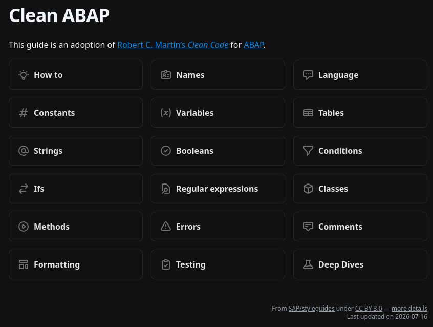

# abap_tidy

A Hugo project that turns SAP's [Clean ABAP](https://github.com/SAP/styleguides) style guide into a browsable, cross-referenced website, built on the [Hextra](https://github.com/imfing/hextra) theme.

[](https://brickup-de.github.io/abap_tidy/)

The Markdown under `content/` is generated, not hand-written — it's produced from the upstream style guide by a Python conversion pipeline. The only exceptions are the hand-written pages listed under `[content].preserve` in `data/mapping.toml` (currently just `legal.md`), which the pipeline never touches.

## Quick start

```sh
git submodule update --init --recursive   # pull in the source style guides
npm install
python3 refresh_content.py                # regenerate content from upstream CleanABAP project
npm run dev                               # hugo server at localhost:1313 (no ABAP syntax highlighting)
```

Other scripts:

```sh
npm run build     # hugo --minify + ABAP syntax highlighting pass
npm run preview   # build, then serve /public on :1414 (with syntax highlighting)
```

**No hand-edited generated files under `content/`** — they're git versioned so diffs are easy to review.
To change the generated content, change the script and re-run it.

## Tests

AI had its fun here. Probably the tests aren't that useful, but to run them:

```sh
python3 -m pytest scripts/tests/
```

## Repo layout

- `scripts/` — the Markdown → Hugo conversion pipeline and its tests
- `content/` — generated Hugo content (do not edit directly, except hand-written pages listed in `[content].preserve`)
- `assets/sap-styleguides/` — the upstream Clean ABAP style guide, as a git submodule
- `layouts/` — Hugo template overrides (Hextra theme customizations)
- `docs/agents/` — process docs for AI coding agents working in this repo (issue tracking, triage labels, domain docs). Created by experimenting with [Matt Pocock's Skills](https://github.com/mattpocock/skills).

See [AGENTS.md](AGENTS.md) for the ground rules agents should follow when working in this repo.
