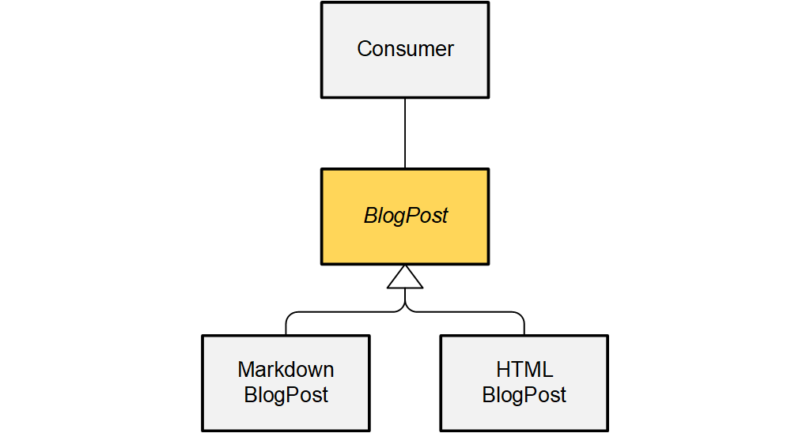

```ABAP
CLASS /clean/blog_post DEFINITION PUBLIC ABSTRACT CREATE PROTECTED.
  PUBLIC SECTION.
    METHODS publish ABSTRACT.
ENDCLASS.

CLASS /clean/blog_post IMPLEMENTATION.
ENDCLASS.
```
An abstract class differs from regular classes in that it can’t be instantiated. Only 
sub-classes of the abstract class can be instantiated. An abstract class should contain 
at least one abstract method. An abstract method is declared in the abstract class, 
and then implemented in the sub-classes of the abstract class.

Abstract classes allow connecting only code that
fits the inheritance pattern.

On the one hand, they unify code and design across objects-of-a-kind,
making it easier to implement things by providing default implementations,
frames, and helper methods.

On the other hand, they squeeze sub-classes into their predefined scheme,
and force them to accept any code they provide.

```ABAP
CLASS /clean/markdown_blog_post DEFINITION
    PUBLIC CREATE PUBLIC
    INHERITING FROM /clean/blog_post.
  PUBLIC SECTION.
    METHODS constructor.
    METHODS publish REDEFINITION.
ENDCLASS.

CLASS /clean/markdown_blog_post IMPLEMENTATION.

  METHOD constructor.
    super->constructor( ).
  ENDMETHOD.
  
  METHOD publish.
  ENDMETHOD.
  
ENDCLASS.
```



> **Class diagram.**
The abstract class `BlogPost` has two sub-classes
`MarkdownBlogPost` and `HTMLBlogPost`.
Both fit into the "frame" specified by `BlogPost`,
probably inheriting some methods and attributes from their super-class.
