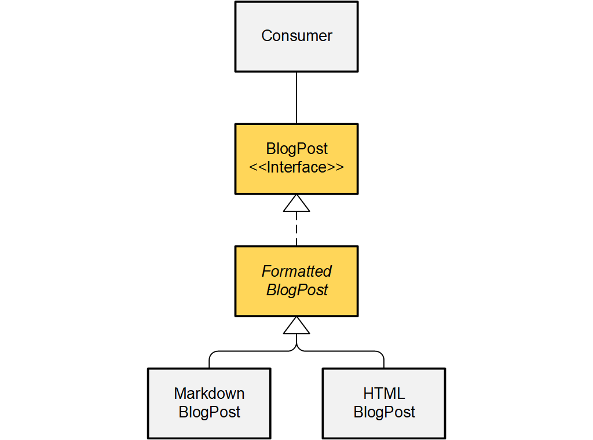

Instead of using abstract classes as alternative to interfaces,
you should use both in combination to decouple dependencies.

```ABAP
INTERFACE /clean/blog_post.
  METHODS publish.
ENDINTERFACE.
```

```ABAP
CLASS /clean/formatted_blog_post DEFINITION PUBLIC ABSTRACT CREATE PROTECTED.
  PUBLIC SECTION.
    INTERFACES /clean/blog_post.
ENDCLASS.

CLASS /clean/formatted_blog_post IMPLEMENTATION.

  METHOD /clean/blog_post~publish.
    " default implementation
    " sub-classes can use it
    " or override the method with something else
  ENDMETHOD.
  
ENDCLASS.
```



> **Class diagram.**
The interface `BlogPost` specifies the "contract"
that all blog posts will fulfill.
The developers decided to use an inheritance scheme to implement
different "flavors" of blog posts,
using an abstract class `FormattedBlogPost` with two sub-classes
`MarkdownBlogPost` and `HTMLBlogPost`.
