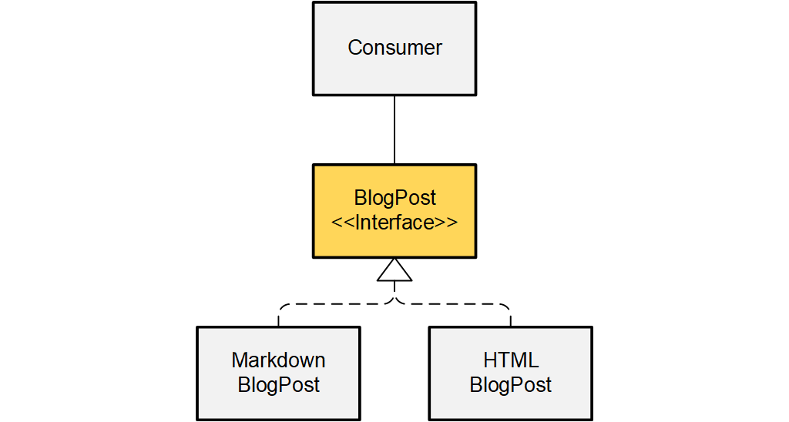

```ABAP
INTERFACE /clean/blog_post.
  METHODS publish.
ENDINTERFACE.
```

Interfaces allow connecting any kind of code,
as long as it satisfies the interface.

They don't impose any
side expectations or restrictions upon the implementation.

In turn, they don't help implementing the required methods
with default code or helper methods.

```ABAP
CLASS /clean/markdown_blog_post DEFINITION PUBLIC CREATE PUBLIC.
  PUBLIC SECTION.
    INTERFACES /clean/blog_post.
ENDCLASS.

CLASS /clean/markdown_blog_post IMPLEMENTATION.
  
  METHOD publish.
  ENDMETHOD.
  
ENDCLASS.
```



> **Class diagram.**
The `BlogPost` interface has two alternative
implementations `MarkdownBlogPost` and `HTMLBlogPost`.
Both fulfill the same "contract", specified by  `BlogPost`,
but don't share any code.
